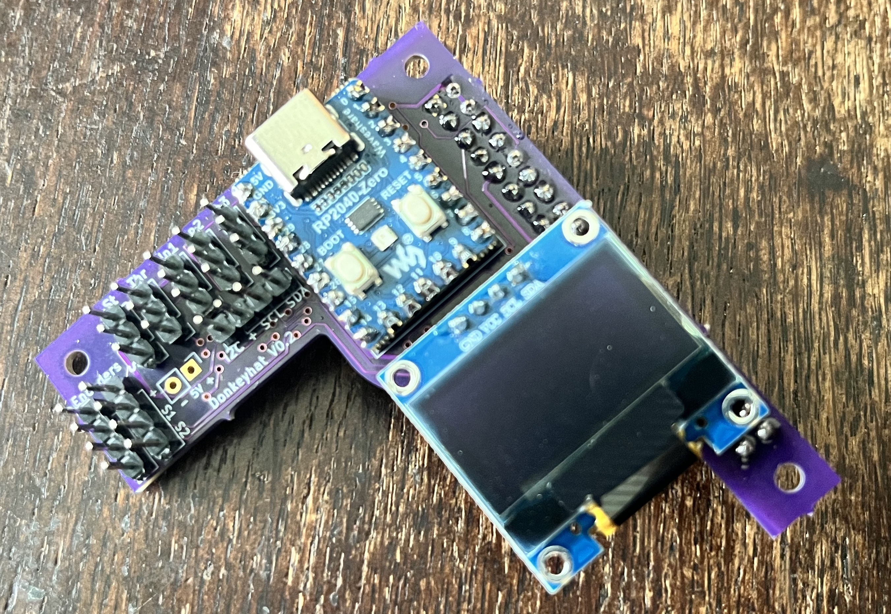

# donkeycar51_pi5_donkeyhatV0.2
this repo documents the installation of DonkeyCar 5.1 on a Raspberry 5 with a donkyhat V0.2 

## Donkeyhat V0.2, thx to [Chris](https://github.com/zlite)


[code](./rp2040/)

## [installation](http://docs.donkeycar.com)
- [x] SD-card Bookworm 5.2, March 2024
- [x] pip install donkeycar[pi]
- [x] install missing dependencies for *donkey ui*
    ```
    pip install kivy
    pip install plotly
    pip install albumentations
    ```
- [x] testing camera `libcamera-still -o test.jpg`
- [x] VScode
    ```
    sudo apt update
    sudo apt install code
    ```
- [ ] set `DRIVE_TRAIN_TYPE = "<not implemented yet>"`
- [ ] [wifi hotspot](https://medium.com/@jones.0bj3/wireless-networking-for-the-jetson-nano-and-rpi-504868dd1b3a)
```
sudo -i -u rainer nmcli dev wifi hotspot ifname wlan1 ssid rbnano1-drivingnetwork password XXXXXXXX
```
